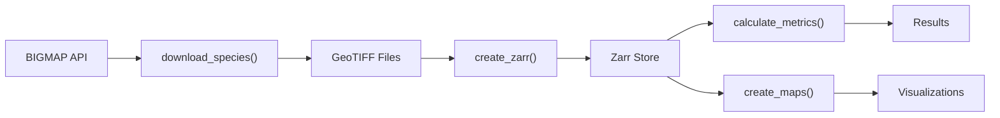

# Data Pipeline

This guide covers the full data pipeline: downloading species biomass rasters from the FIA BIGMAP service, converting them to Zarr format, and running analysis.

## Overview



## Step 1: Download Species Data

Use `download_species()` to fetch biomass rasters from the USDA Forest Service BIGMAP ImageServer:

### By State

```python
from gridfia import GridFIA

api = GridFIA()

# Download all species for an entire state
files = api.download_species(
    state="Montana",
    output_dir="data/montana"
)
print(f"Downloaded {len(files)} species files")

# Download specific species only
files = api.download_species(
    state="Montana",
    species_codes=["0202", "0122"],  # Douglas-fir, Ponderosa pine
    output_dir="data/montana_pines"
)
```

### By County

```python
files = api.download_species(
    state="North Carolina",
    county="Wake",
    species_codes=["0131", "0068"],
    output_dir="data/wake"
)
```

### By Bounding Box

```python
files = api.download_species(
    bbox=(-79.5, 35.5, -78.5, 36.5),
    crs="4326",
    species_codes=["0131"],
    output_dir="data/custom"
)
```

### By Polygon

```python
files = api.download_species(
    polygon="study_area.geojson",
    species_codes=["0131", "0068"],
    output_dir="data/study_area"
)
```

### With Boundary Clipping

Store the actual state/county boundary for later clipping during Zarr creation:

```python
files = api.download_species(
    state="Texas",
    county="Harris",
    species_codes=["0131"],
    output_dir="data/harris",
    use_boundary_clip=True  # Stores boundary for create_zarr()
)
```

## Step 2: Create Zarr Store

Convert downloaded GeoTIFF files to cloud-optimized Zarr format:

```python
# Basic usage
zarr_path = api.create_zarr(
    input_dir="data/montana_pines",
    output_path="data/montana_pines.zarr"
)

# With custom chunking and compression
zarr_path = api.create_zarr(
    input_dir="data/montana_pines",
    output_path="data/montana_pines.zarr",
    chunk_size=(1, 2000, 2000),  # Larger chunks for faster reads
    compression="zstd",
    compression_level=3
)

# With polygon clipping (auto-detect from saved config)
zarr_path = api.create_zarr(
    input_dir="data/harris",
    output_path="data/harris.zarr",
    clip_to_polygon=True  # Uses boundary saved by download_species()
)
```

### Validate the Store

```python
info = api.validate_zarr(zarr_path)
print(f"Shape: {info['shape']}")
print(f"Species: {info['num_species']}")
print(f"CRS: {info['crs']}")
```

### Why Zarr?

- **Chunked storage** -- only load the data you need
- **Compression** -- typically 3-5x reduction in storage size
- **Parallel access** -- multiple processes can read simultaneously
- **Cloud-ready** -- works with S3, GCS, and other object storage
- **Expandable** -- add species without rewriting existing data

### Data Structure

The Zarr store organizes data as a 3D array:

```
Dimensions: (species, height, width)
  species[0]: Total biomass (sum of all species)
  species[1]: Species 1 (e.g., Loblolly Pine)
  species[2]: Species 2 (e.g., Douglas-fir)
  ...
```

Default chunking is `(1, 1000, 1000)` -- one species layer at a time, in 1000x1000 pixel spatial tiles (~4MB per chunk with LZ4 compression).

## Step 3: Calculate Metrics

Run forest metric calculations on the Zarr data:

```python
# List available calculations
calcs = api.list_calculations()
print(f"Available: {calcs}")

# Run specific calculations
results = api.calculate_metrics(
    zarr_path,
    calculations=["species_richness", "shannon_diversity", "total_biomass"],
    output_dir="output/metrics"
)

for result in results:
    print(f"{result.name}: {result.output_path}")
```

### With Statistical Context

```python
api = GridFIA(seed=42)
results = api.calculate_metrics_with_stats(
    zarr_path,
    calculations=["shannon_diversity", "species_richness"],
    n_bootstrap=1000,
    confidence_level=0.95
)
for name, result in results.items():
    print(f"{name}: {result.value:.3f} "
          f"[{result.confidence_interval[0]:.3f}, {result.confidence_interval[1]:.3f}]")
```

## Step 4: Visualize

Generate publication-ready maps:

```python
# Diversity maps
maps = api.create_maps(zarr_path, map_type="diversity", output_dir="maps/")

# Species biomass map
maps = api.create_maps(
    zarr_path,
    map_type="species",
    species=["0202"],
    state="MT"
)
```

## Complete Example

```python
from gridfia import GridFIA

api = GridFIA()

# Download
files = api.download_species(
    state="North Carolina",
    county="Wake",
    species_codes=["0131", "0068", "0110"],
    output_dir="tutorial_data"
)

# Convert
zarr_path = api.create_zarr(
    input_dir="tutorial_data",
    output_path="tutorial_data/wake.zarr"
)

# Analyze
results = api.calculate_metrics(
    zarr_path,
    calculations=["species_richness", "shannon_diversity", "total_biomass"],
    output_dir="output"
)

# Visualize
maps = api.create_maps(zarr_path, map_type="diversity", output_dir="output/maps")

print("Analysis complete!")
```

## Advanced: Direct REST Access

For advanced use cases, you can use the `BigMapRestClient` directly:

```python
from gridfia.external.fia_client import BigMapRestClient

client = BigMapRestClient()

# List available species
species = client.list_available_species()
for s in species[:5]:
    print(f"{s['species_code']}: {s['common_name']}")

# The client handles:
# - Automatic retry with exponential backoff
# - Rate limiting to respect server constraints
# - Progress tracking for long-running downloads
# - Chunked downloads for large areas
```

!!! note
    Most users should use `GridFIA.download_species()` instead of the REST client
    directly. The client is exposed for advanced use cases that need finer control
    over the download process.

## See Also

- [Cloud Data Access](cloud-data.md) - Stream pre-hosted data without downloading
- [API Reference: GridFIA](../api/gridfia.md) - Full method documentation
- [Calculations](../api/calculations.md) - Available forest metrics
